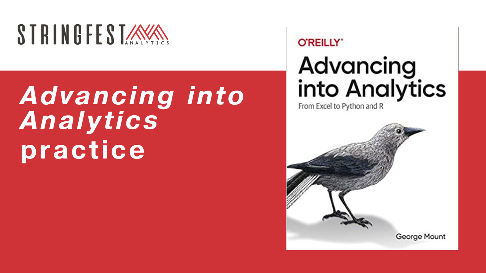

# _Advancing into Analytics_ practice bank

<!---
https://stackoverflow.com/questions/27981247/github-markdown-same-page-link
-->



This repo contains extra practice sets based on [_Advancing into Analytics: From Excel to Python and R_](http://stringfestanalytics.com/book/).


[Part I: Foundations of Analytics in Excel](#part-i)
[Part II: From Excel to R](#part-ii)
[Part III: From Excel to Python](#part-iii)


Solutions are available for [students of _Advancing into Analytics_ courses](http://stringfestanalytics.com/aina-waiting/). I can also provide to high school or college teachers using the book in their course. [Learn more about using _Advancing into Analytics_ in the classroom here](http://stringfestanalytics.com/aina-for-teachers/). You can drop me a line there.   

All datasets referred to can be found in the [`datasets` subfolder](https://github.com/stringfestdata/advancing-into-analytics-practice/tree/main/datasets). There is also [a file with links to their sources](https://github.com/stringfestdata/advancing-into-analytics-practice/blob/main/about-the-datasets.md) where you can get column definitions and so forth.    

[Helper file for George](https://maqimzmnjbt5wavnbicv98tlhog-my.sharepoint.com/:w:/g/personal/george_stringfestanalytics_com/Ee8VCSWvX2hHhD4P3oSIMvsBEiRjzFVwKyCaaLi73kRb_Q?e=1si4wg)

<h1 id="part-i">
Part I: Foundations of Analytics in Excel
</h1>


## 1. Foundations of Exploratory Data Analysis  X

Using the `titanic` dataset and Excel: 

1.	Classify each variable’s type.
2.	Build and visualize a two-way frequency of `Pclass` by `Survived`.
3.	Return descriptive statistics for `Fare`. How does the distribution differ by `Pclass`?
4.	Visualize the distribution of `Age`.


## 2. Foundations of Probability  X

1. Simulate 100 coin tosses and visualize the result as a histogram in Excel. Do some online research -- what probability distribution does a series of coin tosses follow?
2. Now take the average of twenty coin tosses and visualize the distribution of 100 such averages as a histogram. What probability distribution do the sample means follow? 
3. Plot two probability distributions in Excel on the same area graph: one with a mean of 25 and standard deviation of 8, the other with 40 and 2, respectively. 

## 3. Foundations of Inferential Statistics  X

Using the `geyser` dataset, test the relationship between the kind of eruption (long or short) and the waiting time until the next eruption:
  - What are your statistical hypotheses?
  - Are your results statistically significant? What evidence does this lend to your hypotheses?
  - What is the estimated effect size?
2.	Answer the same questions, but for the relationship between having a CD-ROM and the price of the computer in the `computers` datset.


## 4. Correlation and Regression 

1. Using the `car-prices` dataset:
- What is the correlation between mileage and price?
- Which is the independent and dependent variable?
- Find the coefficents and their statistical significant along with the R-square of the regression model.

2. Using the `birthweights` dataset:
- Derive a correlation for all relevant variables.
- Build a regression model for a sensible independent and dependent variable. Make sure to check for any assumptions first. Report all those regression outputs you've come to know and love!

## 5. The Data Analytics Stack  X

This chapter is a conceptual overview of how Excel, R and Python fit into the broader data analytics stack. If you'd like to get started learning other elements of analytics, I suggest the following resources:

- [DataCamp's free Introduction to SQL course](https://www.datacamp.com/courses/introduction-to-sql)
- 
- If you're on Mac and can't run Power BI, start with [Tableau Public](https://public.tableau.com/en-us/s/resources) instead


<h1 id="part-ii">
Part II: From Excel to R
</h1>


## 6. First Steps with R for Excel Users

- Run the following code. What happens?

```{r}
temps <- c(66, 71, 68, 74, 70)
days <- c('Mon', 'Tue', 'Wed', 'Thr', 'Fri')

names(temps) <- days

temps['Wed']
```

 - Knowing what you do now, return the values for Monday and Friday first by index position, then by name. 


- Explore the R Help page in RStudio: from the menu click Help > R Help. 
- [Create an RStudio Community account](https://community.rstudio.com)

If you would like additional reading:

- A Tour of R and RStudio
- Five Things Excel Users Should Know about R
- What is an open source software distribution? 

## 7. Data Structures in R

- *Easter egg time!* In this chapter we used the  🤓
-

## 8. Data Manipulation and Visualization in R


## 9. Capstone: R for Data Analytics

Using the `birthweights` dataset 

1.	Visualize the distribution of red blood cell count (rcc) by sex (sex).
2.	Is there a significant difference in red blood cell count between the two groups of sex?
3.	Produce a correlation matrix of the relevant variables in this dataset.
4.	Visualize the relationship of height (ht) and weight (wt).
5.	Regress ht on wt. Find the equation of the fit regression line. Is there a significant relationship? What percentage of the variance in ht is explained by wt?
6.	Split your regression model into training and testing subsets. What is the R-squared and RMSE on your test model?


- **Extra credit**: Conduct your work in an [R Notebook](https://bookdown.org/yihui/rmarkdown/notebook.html?_ga=2.192006506.1923766174.1629579433-21366166.1628973922) (included with RStudio) or Jupyter Notebook (see [instructions here](https://irkernel.github.io/installation/) for using R with Jupyter!)

<h1 id="part-iii">
Part III: From Excel to Python
</h1>


## 10. First Steps with Python for Excel Users  X

- Continue getting to know the Jupyter interface. In particular, under the Help menu you will find an interactive "User Interface Tour" to walk you through the interface, as well as a guide to Markdown, which you may need for the next exercise... 
- Practice your Markdown skills by including the following elements in a notebook:
  - Two different levels of headers
  - Italics
  - A hyperlink
  - An image
- Google Colab is a free cloud-based environment based on the Jupyter Notebook. This is a great tool for sharing your data projects on the web. Check out this [introductory Colab notebook](https://colab.research.google.com/notebooks/intro.ipynb#scrollTo=5fCEDCU_qrC0) to get started.

Further reading: 

- 
-   (Note: The downloadable file is available to you in this repo)
- 

## 11. Data Structures in Python

Further reading:  

- 


## 12. Data manipulation and visualization in Python

## 13. Capstone: Python for Data Analytics

## 14. Conclusion and Next Steps   X

The conclusion offers a few next steps for continuing on in your analytics journey. Here are a couple of "quick wins" on that front:

- If you've not already downloaded GitHub Desktop, do it now. If you have, continue to practice. Either way, the [official Desktop documentation](https://docs.github.com/en/desktop) is a great place to learn more.
- Read ["How to Design Smart Business Experiments" by Thomas H. Davenport](https://docs.github.com/en/desktop) (*Harvard Business Review*)

Thanks for "advancing into analytics" with me .... _roll credits_!


# Part 1
